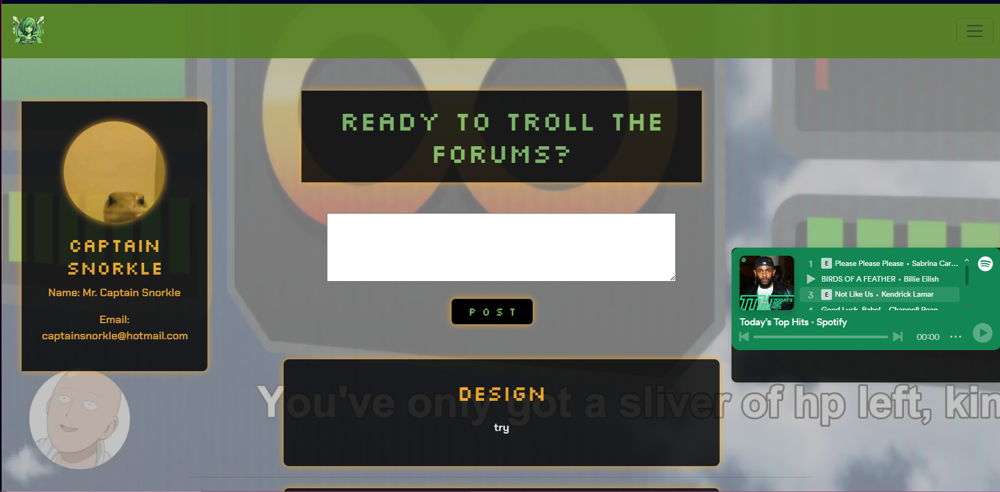
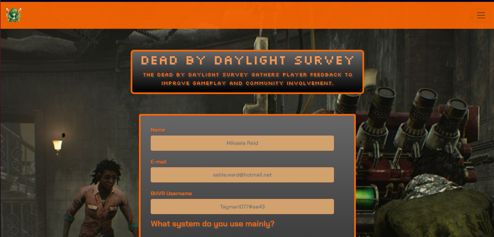

# Enjoy the Microblog Project and the MicroblogLite API!

Don't forget to read the [*MicroblogLite* API docs](http://microbloglite.us-east-2.elasticbeanstalk.com/docs) and experiment with the API in *Postman!*

Practice and experimentation provide experience, and experience provides confidence.

# Level Up Lounge Microblog

## Table of Contents
- [Description](#description)
- [Features](#features)
- [Installation](#installation)
- [Screenshots](#screenshots)

## Description
The Level Up Lounge is a dynamic and interactive gaming blog designed for enthusiasts to share their passion for video games. This platform allows users to browse existing posts, create new content, and engage with a community of like-minded gamers. Whether you're into the latest releases, classic titles, or industry news, The Level Up Lounge is your go-to destination for all things gaming.

## Features
- Walled Garden Landing Page for Users to enjoy
- Customizations that bring back MySpace nostalgia
- Embedded Spotify so Users can listen to their favorite tunes while enjoying the UI.

## Screenshots
- Landing Page


-Profile


-Posts


-Gaming Survey Form


-Speakeezy Lounge


## Installation
Step-by-step instructions on how to install and set up the project locally.

```bash
# Clone the repository
git clone https://github.com/yourusername/your-repo.git

# Navigate to the project directory
cd your-repo

# Install dependencies
npm install
